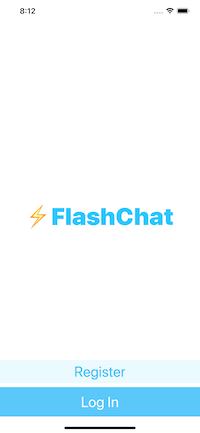

# Flash-Chat

Flash Chat is an internet based messaging app similar to WhatsApp. 

## About The Project

* Storyboard UI
* Integrate third party libraries using Cocoapods and Swift Package Manager.
* Store data in the cloud using Firebase Firestore.
* Query and sort the Firebase database.
* Firebase for user authentication, registration and login.
* Working with UITableViews
* Custom views using .xib files to modify native design components.
* Embed View Controllers in a Navigation Controller.
* Constants file and use static properties to store Strings and other constants.
* Create animations using loops.
* Direct Segues for navigation.

